# **RegexOne Docs**

# Level 1:

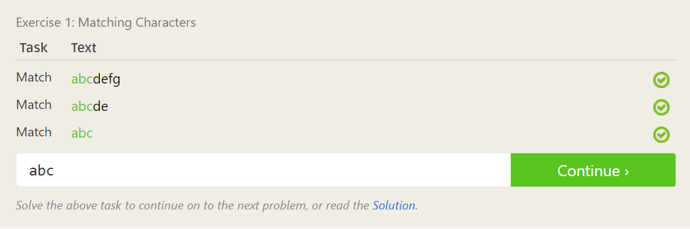

# Level 1.5:

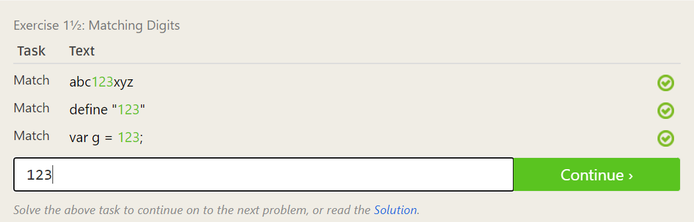

# Level 2:

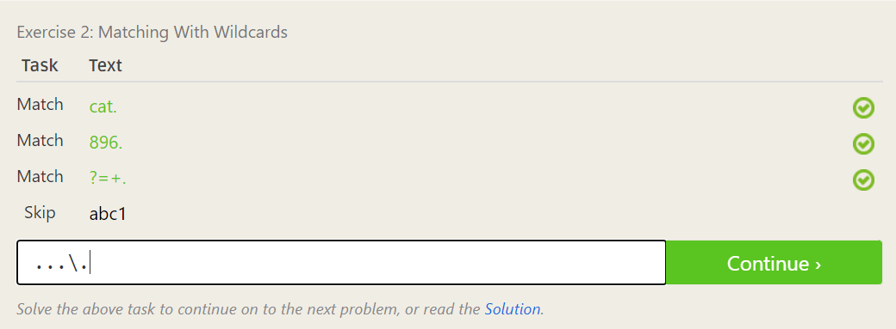

# Level 3:

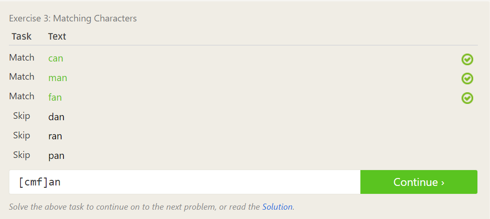

# Level 4:

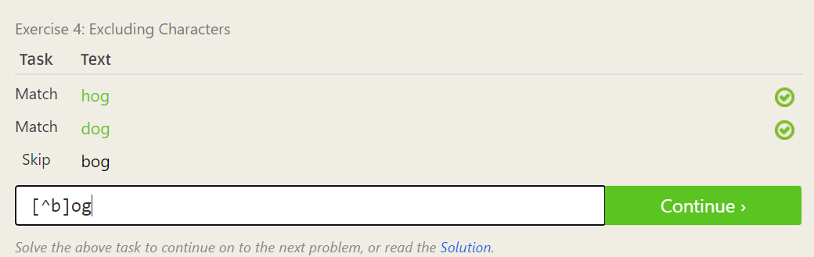

# Level 5:

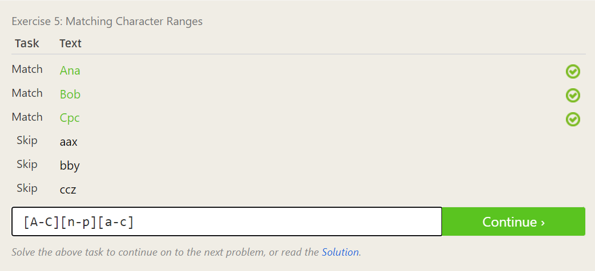

# Level 6:

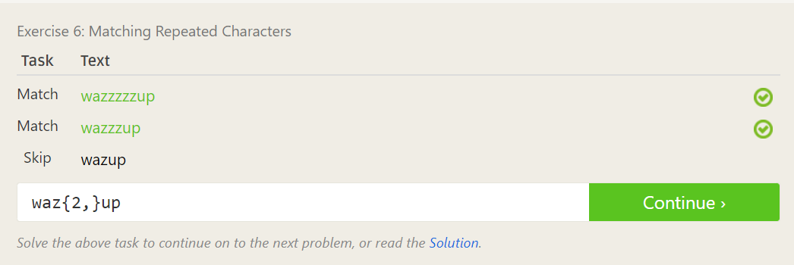

# Level 7:

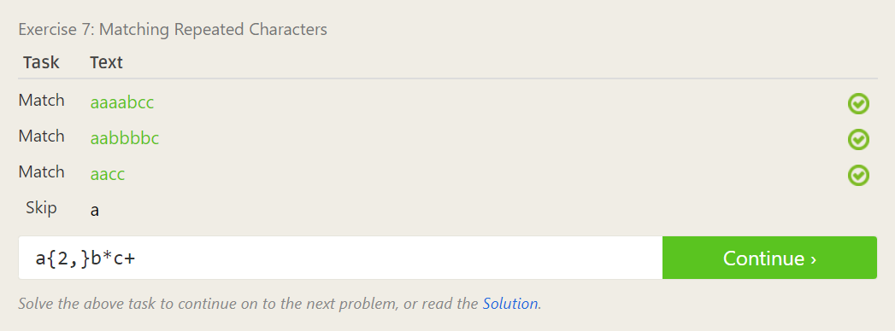

# Level 8:

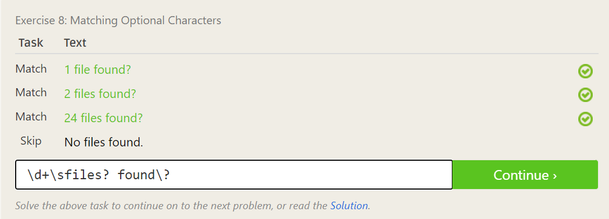

# Level 9:

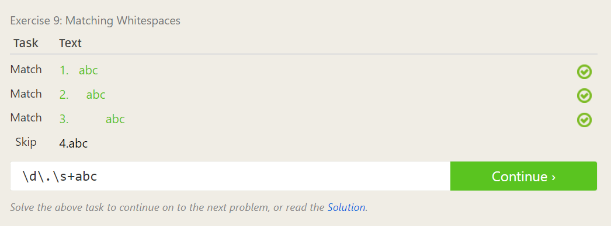

# Level 10:

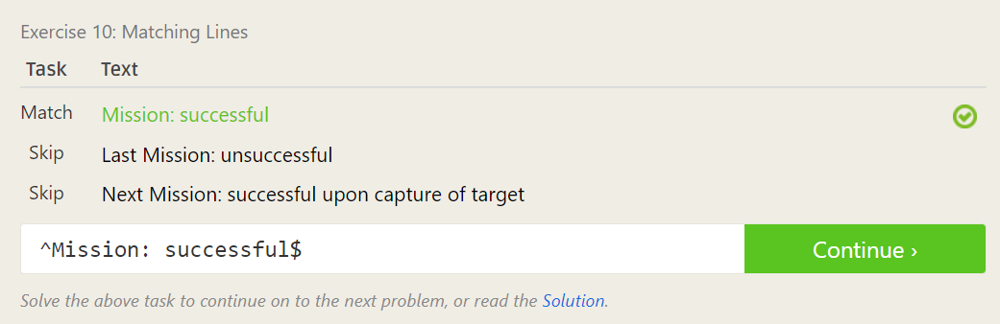

# Level 11:

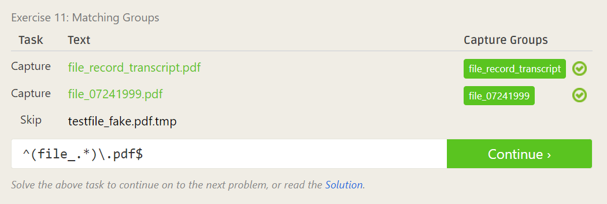

# Level 12:

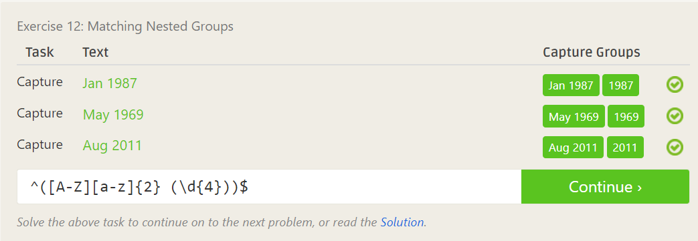

# Level 13:

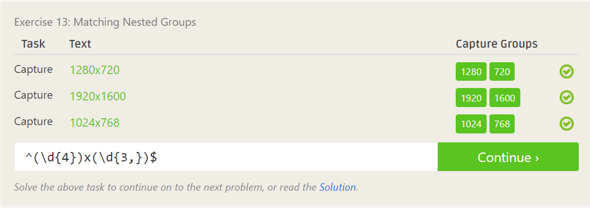

# Level 14:

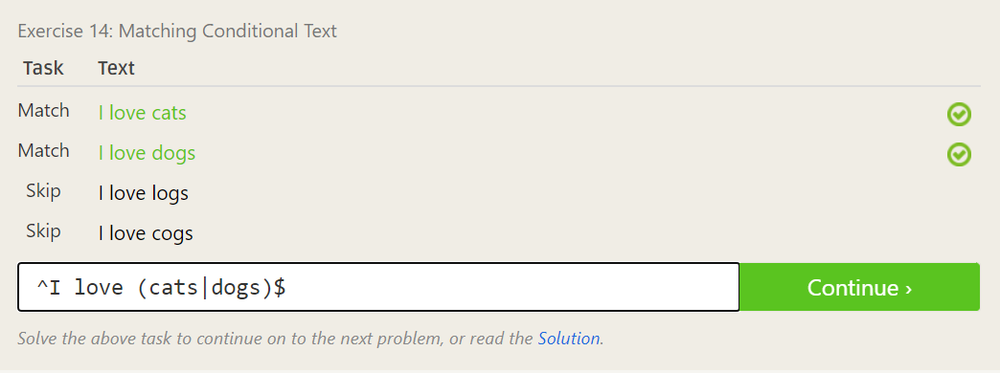

# Level 15:

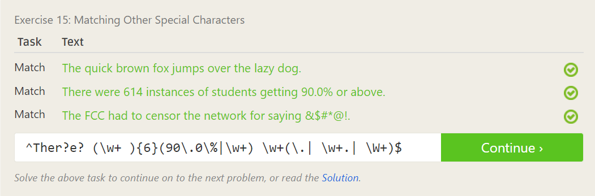

# ***Congrats !!!***

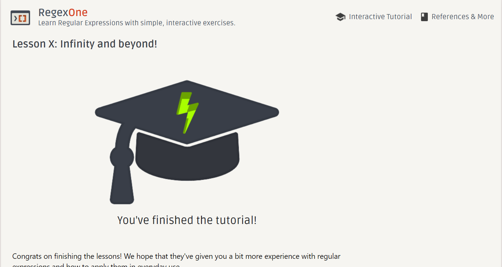